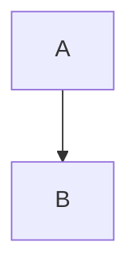

# Kitchen Sink

Every Plan 1 preview feature in one file. Open it with `make run` → File → Open.

## Inline

Plain, *emphasis*, **strong**, ***both***, ~~strikethrough~~, `inline code`, <kbd>⌘</kbd>,
a [link to example.com](https://example.com "Title"), an autolink www.example.com,
math $E = mc^2$ (shown as source until Plan 2), currency $5 and $10, and a footnote[^note].
Line one with a hard break\
line two.

## Headings

### Level 3
#### Level 4
##### Level 5
###### Level 6

## Lists

1. First
2. Second
   - nested bullet
     - deeper bullet
3. Third

5. Starts at five
6. Six

- [x] Task done
- [ ] Task open

- Loose item one

- Loose item two

## Quote

> A quote with **bold**.
>
> > A nested quote.

## Code

```swift
struct Hello {
    let name = "MDSyndrome"
}
```

    indented code block



## Table

| Left | Center | Right |
|:-----|:------:|------:|
| a    | b      | c     |
| long cell content | x | 1 |

## Math block

$$
\int_0^1 x^2 \, dx = \frac{1}{3}
$$

## Images

Relative SVG (needs the document saved in `Fixtures/`):


Missing image:


## HTML and rule

<div align="center">raw html block</div>

---

[^note]: The footnote text.
