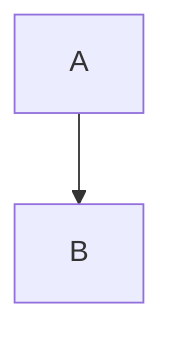
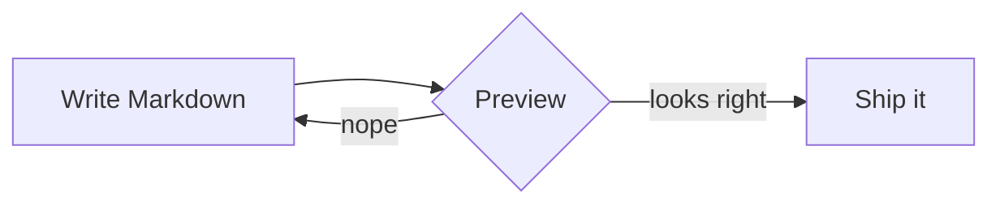
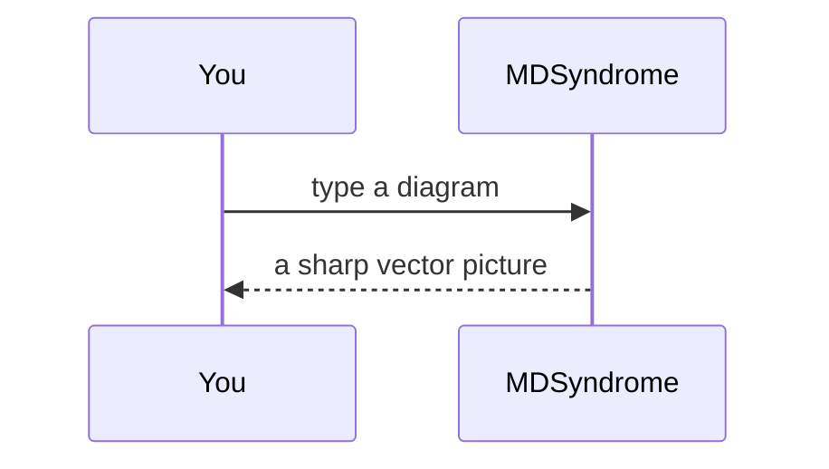
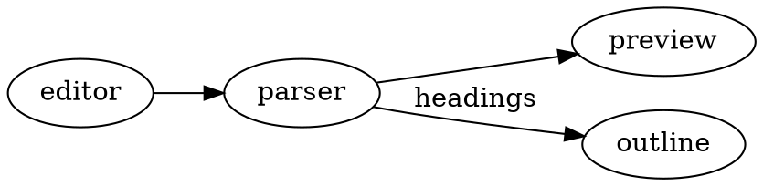

# Kitchen Sink

Every supported preview feature in one file. Open it with `make run` → File → Open.

## Inline

Plain, *emphasis*, **strong**, ***both***, ~~strikethrough~~, `inline code`, <kbd>⌘</kbd>,
a [link to example.com](https://example.com "Title"), an autolink www.example.com,
math $E = mc^2$, currency $5 and $10, and a footnote[^note].
Line one with a hard break\
line two.

## Headings

### Level 3
#### Level 4
##### Level 5
###### Level 6

## Lists

1. First
2. Second
   - nested bullet
     - deeper bullet
3. Third

5. Starts at five
6. Six

- [x] Task done
- [ ] Task open

- Loose item one

- Loose item two

## Quote

> A quote with **bold**.
>
> > A nested quote.

## Code

```swift
struct Hello {
    let name = "MDSyndrome"
}
```

    indented code block



## Table

| Left | Center | Right |
|:-----|:------:|------:|
| a    | b      | c     |
| long cell content | x | 1 |

## Math block

$$
\int_0^1 x^2 \, dx = \frac{1}{3}
$$

## Images

Relative SVG (needs the document saved in `Fixtures/`):


Missing image:


## HTML and rule

<div align="center">raw html block</div>

---

## Plan 2: native rendering

Inline math $\frac{a}{b} + \sqrt{x}$, a formula SwiftMath can't typeset $\operatorname{sin} x$,
==highlighted text==, H<sub>2</sub>O, x<sup>2</sup>, <u>underlined</u>, press <kbd>⌘</kbd> <kbd>K</kbd>.

$$
\begin{pmatrix} 1 & 2 \\ 3 & 4 \end{pmatrix} \cdot \vec{v} = \lambda \vec{v}
$$

```python
@cache
def fib(n: int) -> int:
    """Fibonacci, memoised."""
    return n if n < 2 else fib(n - 1) + fib(n - 2)  # recursion
```

```json
{ "name": "MDSyndrome", "native": true, "version": 0.2 }
```

```diff
- needs Rosetta
+ native on Apple Silicon
```

<p align="center">
   
</p>

<h3 align="center">A centred HTML heading</h3>

<details>
<summary><b>Click to expand</b></summary>

Hidden **Markdown** inside a `<details>` block.

</details>

## Plan 4: web renderers







A formula SwiftMath can't typeset, $\operatorname{lcm}(a,b)=\frac{ab}{\gcd(a,b)}$, sits inline, and this one is a block:

$$
\begin{aligned} \operatorname{sin}^2 x + \cos^2 x &= 1 \\ e^{i\pi} + 1 &= 0 \end{aligned}
$$

<table>
  <tr><th>Renderer</th><th>Used for</th></tr>
  <tr><td>mermaid</td><td>flowcharts, sequence diagrams, …</td></tr>
  <tr><td>viz.js</td><td>Graphviz <code>dot</code></td></tr>
  <tr><td>KaTeX</td><td>math SwiftMath can't do</td></tr>
</table>

```mermaid
this is not a diagram
```

## Plan 5: navigation

Open the outline with <kbd>⌃⌘S</kbd>, scroll either pane and watch the other follow, and click the links below.

### Links

- A heading in this document: [Inline](#inline), or the one above: [Plan 5: navigation](#plan-5-navigation).
- Duplicate headings get numbers, as on GitHub: [first Details](#details), [second Details](#details-1).
- Non-ASCII and percent-encoded: [café menu](#café-menu), [café, encoded](#caf%C3%A9-menu).
- Another document, opened here: [the editing fixture](editing.md).
- A file that is not there (beeps): [missing](nothing-here.md).
- A file that is not Markdown (asks first): [the badge](images/badge.svg).
- The web, in your browser: [example.com](https://example.com).
- Something else (asks first): [call someone](tel:+1555010100).
- A note with a way back[^nav].

### Details

The first of two headings with the same name.

### Details

The second one, whose anchor is `#details-1`.

### Café menu

A heading with an accent, to try `#café-menu` and `#caf%C3%A9-menu`.

### Tasks

Click a checkbox in the preview to tick it in the source; ⌘Z takes it back.

- [ ] Click me
- [x] Already done
- [ ] A task with a nested one
  - [ ] The nested task

[^note]: The footnote text.
[^nav]: The footnote's back-link, the arrow, takes you to the paragraph that cites it.
