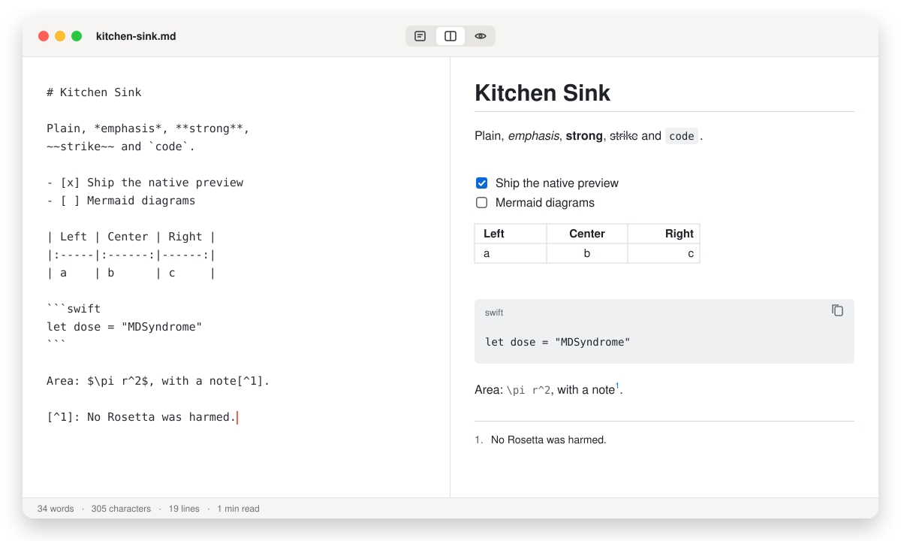
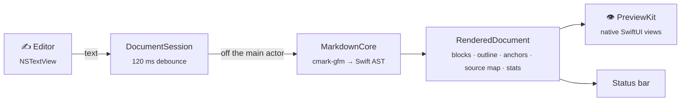

<p align="center">
  
</p>

<h1 align="center">MDSyndrome</h1>

<p align="center">
  <b>A native Markdown editor for the Mac.</b><br>
  Prescribed for chronic MacDown withdrawal. No Rosetta required.
</p>

<p align="center">
  <a href="https://github.com/kemalmaulana/MDSyndrome/actions/workflows/ci.yml"></a>
  <a href="https://github.com/kemalmaulana/MDSyndrome/releases"></a>
  
  
  
  <a href="LICENSE"></a>
</p>

<p align="center">
  
  <br><sub><i>Illustration of the current build. Real screenshots will ship with the first release.</i></sub>
</p>

---

## 🩺 The diagnosis

You write everything in Markdown: READMEs, meeting notes, grocery lists, love letters. For years
[MacDown](https://macdown.uranusjr.com) was your editor. Then you noticed it only ever shipped an
**Intel binary**. It has been quietly running under Rosetta 2, Rosetta is on its way out, and MacDown's
development has stopped.

**MD Syndrome** (n.): *the persistent urge to open a `.md` file in a split-pane editor, combined with
the absence of one that still runs natively.*

**The treatment:** MDSyndrome is a new, open-source editor written from scratch in **Swift 6 and SwiftUI**.
It runs natively on Apple Silicon, has no Electron, and renders its preview natively with no web view.

## 💊 What it treats

| Symptom | Relief | Status |
|---|---|:---:|
| "My editor runs under Rosetta" | Universal binary, native on Apple Silicon | ✅ |
| "I want to see what I'm writing" | Editor, live native preview, or both side by side: <kbd>⌥⌘1</kbd> <kbd>⌥⌘2</kbd> <kbd>⌥⌘3</kbd> | ✅ |
| "GitHub renders it differently" | Same engine as GitHub ([cmark-gfm](https://github.com/swiftlang/swift-cmark)): tables, task lists, ~~strikethrough~~, autolinks, footnotes | ✅ |
| "Typing lags on my 1 MB changelog" | Parsing runs off the main thread, and the preview catches up shortly after you pause (about 55 ms for a 200 KB note; a huge file waits at most 120 ms). A keystroke in a 1 MB file costs a fraction of a millisecond; parsing 1 MB takes about 0.15 s ([numbers](#-performance)) | ✅ |
| "I pasted a screenshot" | Paste or drop a picture into the editor: it is saved next to the document (in `assets/`, changeable in Settings ▸ Editor) and linked. A document with no file yet asks to be saved first | ✅ |
| "Where did my badges go?" | Relative, absolute and remote images, SVG included | ✅ |
| "Is this file going to do something weird?" | No script in a document ever runs. Web and mail links open, a link to another Markdown file opens it here, and anything else asks first; a program is never run from a link. A file nested 5,000 levels deep won't crash it | ✅ |
| "How long is this thing?" | Live words, characters, lines and reading time | ✅ |
| "Where was that again?" | Find in the editor and in the preview, with highlighted matches, a match count and next/previous | ✅ v0.3 |
| "Documents just work" | New, Open, Recent, autosave, Versions, tabs, undo that behaves. A file another program saved is picked up when you come back to the app, or on <kbd>⌘R</kbd> | ✅ |
| "Closing the window should close the app" | Closing the last document window quits the app, like <kbd>⌘Q</kbd>. Settings ▸ General turns it off if you prefer the Dock behaviour | ✅ |
| `$E = mc^2$` | Native LaTeX math, inline and display (SwiftMath). A formula it can't typeset is drawn by KaTeX instead (v0.4), and if that fails too its source shows in red | ✅ v0.2 |
| ```` ```swift ```` | Syntax-highlighted code blocks in 20+ languages, GitHub colours in light and dark | ✅ v0.2 |
| "My README looks broken" | `<p align="center">`, ``, badge rows, `<details>`, `<kbd>`, `<sub>`/`<sup>` and YAML front matter render natively | ✅ v0.2 |
| `==highlight==` | Marked text, MacDown-style | ✅ v0.2 |
| ```` ```mermaid ```` · ```` ```dot ```` | Mermaid and Graphviz diagrams as sharp vector pictures that follow light and dark mode. A typo shows the library's message above the source | ✅ v0.4 |
| "Where are my editor colours and shortcuts?" | Markdown syntax highlighting in six themes (Tomorrow+ by default), lists that continue, auto-pairing, a Format menu and toolbar: <kbd>⌘B</kbd> <kbd>⌘I</kbd> <kbd>⌘K</kbd> <kbd>⌘1</kbd>–<kbd>⌘6</kbd> | ✅ v0.3 |
| "I lose my place" | The editor and the preview scroll together, block by block, even in a 1 MB document. An outline (<kbd>⌃⌘S</kbd>) lists the headings and takes both panes there. `#anchor` links, links to other Markdown files and footnote links (with a way back) work. Click a task's checkbox in the preview to tick it in the source | ✅ v0.5 |
| "Make it pretty" | A Settings window (<kbd>⌘,</kbd>) with General, Editor, Markdown and Preview tabs, applied live to every open document. Four preview themes (GitHub, Clearness, Solarized, System), six editor themes, preview zoom (<kbd>⌘+</kbd> <kbd>⌘−</kbd> <kbd>⌘0</kbd>), and your own themes as JSON files in `~/Library/Application Support/MDSyndrome/Themes` | ✅ v0.6 |
| "Send it to my boss" | File ▸ Export as HTML… (one self-contained file, light and dark, no script in it) or PDF (paginated, text stays vector), Copy HTML (<kbd>⌥⌘C</kbd>), and Print (<kbd>⌘P</kbd>). Diagrams, formulas, images, code blocks and tables are in both files; in the HTML a diagram is a light and a dark picture | ✅ v0.7 |

✅ ships today · 🧪 in clinical trials (see [the treatment plan](#-treatment-plan))

## 📦 Dosage (install)

1. Download **`MDSyndrome-<version>.dmg`** from [Releases](https://github.com/kemalmaulana/MDSyndrome/releases).
2. Drag **MDSyndrome** into **Applications**.
3. **First launch:** builds without a Developer ID are *ad-hoc signed*, so macOS will hesitate. Do one of these:
   - right-click the app → **Open** → **Open**, or
   - System Settings → Privacy & Security → **Open Anyway**, or
   - `xattr -dr com.apple.quarantine /Applications/MDSyndrome.app`
4. Optional: make it your default. Right-click any `.md` file → **Get Info** → *Open with* → **MDSyndrome** → **Change All…**

Check your download: `shasum -a 256 -c SHA256SUMS.txt` (the checksum file is attached to every release).

> **Requires macOS 26 or later.** Apple Silicon is the target. The universal binary also runs on Intel Macs that can install macOS 26.

## 🧪 Lab work (build from source)

You need macOS 26+, Xcode 26+ and [XcodeGen](https://github.com/yonaskolb/XcodeGen) (`brew install xcodegen`).

```bash
git clone https://github.com/kemalmaulana/MDSyndrome.git && cd MDSyndrome
make run
```

| Command | What it does |
|---|---|
| `make run` | Generate the Xcode project, build Debug, launch the app |
| `make test` | Lint + package tests (`swift test`) + app unit tests: 674 tests |
| `make perf` | Parse and keystroke timings for a 1 MB document, plus launch time, idle CPU and memory of the app (it comes to the front for about 15 seconds) |
| `make test-ui` | 18 UI tests that drive the real app. ⚠️ They take over keyboard and mouse for about a minute |
| `make dist VERSION=1.2.3` | Universal Release build → `dist/` with `.zip`, `.dmg` and `SHA256SUMS.txt` |
| `make gen` | Regenerate `MDSyndrome.xcodeproj` from `project.yml` (the project file is never committed) |
| `make clean` | Remove build output and the generated project |

## 🫀 Anatomy



<sub>GitHub draws that diagram with Mermaid's JavaScript, and so does MDSyndrome since v0.4. It's one of the few places JavaScript gets in; see the pledge below.</sub>

| Module | Organ | Job |
|---|---|---|
| [`MarkdownCore`](Packages/MDKit/Sources/MarkdownCore) | 🧠 brain | Wraps cmark-gfm's C API into an immutable `Sendable` AST. Each block has a stable ID and the source lines it came from. Also protects math, builds heading slugs, the outline, the anchors and a source-line ↔ block map, and the stats |
| [`PreviewKit`](Packages/MDKit/Sources/PreviewKit) | 👁 eyes | One SwiftUI view per block, four preview themes, image loading, link safety, and the HTML and PDF exporters |
| [`EditorKit`](Packages/MDKit/Sources/EditorKit) | ✋ hands | An NSTextView on TextKit 2: live Markdown highlighting, themes, the pure edit transforms behind list continuation and the Format menu, and one-step undo that reaches the document |
| [`WebRenderKit`](Packages/MDKit/Sources/WebRenderKit) | 🔭 lens | The only module that imports WebKit. Draws diagrams, KaTeX formulas and complex HTML in hidden, locked-down web views and returns vector pictures, with a cache, one request at a time, a timeout, and recovery if the web process dies |
| [`SyntaxHighlighting`](Packages/MDKit/Sources/SyntaxHighlighting) | 🎨 colour | The table-driven code lexer the preview uses for fenced code blocks: linear time, no dependencies |
| [`MDSyndrome`](MDSyndrome) | 🫀 heart | `DocumentGroup`, the debounced render session, the split layout, the Settings window, user themes, export and commands |

```text
.
├── MDSyndrome/              app target (SwiftUI)
├── Packages/MDKit/          MarkdownCore · PreviewKit · EditorKit · WebRenderKit · SyntaxHighlighting (+ tests)
├── MDSyndromeTests/         app unit tests        MDSyndromeUITests/  UI tests
├── Fixtures/kitchen-sink.md every supported feature in one file
├── design/                 logo & app-icon sources, exports, guidelines, README art
├── project.yml · Makefile   XcodeGen spec and every command above
└── .github/workflows/       CI and releases
```

## 🧬 The Swift-first pledge

**Swift first.** JavaScript is only allowed where no Swift or native implementation exists. Whatever does need it is
vendored, works offline, starts only when a document needs it, and runs in a hidden, locked-down renderer that
outputs images.

| | Swift / native | JavaScript |
|---|---|---|
| Parsing, preview, scrolling, settings, export | ✅ always | never |
| Code highlighting | ✅ built-in lexer | never |
| LaTeX math | ✅ SwiftMath | KaTeX only for expressions SwiftMath can't handle |
| Mermaid, Graphviz | — | ✅ no native implementation exists |
| README HTML (`<p align>`, ``, `<details>`, `<kbd>`…) | ✅ native | never |
| Tables and styled blocks in raw HTML | — | none: drawn by WebKit with JavaScript switched off |

Only the `WebRenderKit` module imports WebKit, and `make lint` fails the build if anything else does. The libraries are
vendored byte for byte (mermaid 12.1.0, viz.js 3.31.0, KaTeX 0.19.0; checksums in [`VENDORED.md`](Packages/MDKit/VENDORED.md))
and run in a web view nobody ever sees, which:

- loads one fixed page that allows scripts from the app bundle only, and has no network (every other URL is blocked);
- refuses navigation, popups and dialogs;
- receives your document only as data handed to a function, never as script text; mermaid runs in `strict` mode and KaTeX with `trust: false`;
- hands back a picture (PDF) and nothing else.

A document with no diagram, no unusual formula and no complex HTML never starts WebKit at all.

## ⌨️ Reflexes

| Keys | Action |
|---|---|
| <kbd>⌥⌘1</kbd> · <kbd>⌥⌘2</kbd> · <kbd>⌥⌘3</kbd> | Editor only · Editor & Preview · Preview only |
| <kbd>⌘,</kbd> | Settings |
| <kbd>⌘P</kbd> · <kbd>⌥⌘C</kbd> | Print · Copy HTML |
| <kbd>⌘+</kbd> · <kbd>⌘−</kbd> · <kbd>⌘0</kbd> | Preview text bigger · smaller · actual size |
| <kbd>⌃⌘S</kbd> | Show or hide the outline |
| <kbd>⌘N</kbd> · <kbd>⌘O</kbd> · <kbd>⌘S</kbd> | New · Open · Save |
| <kbd>⌘R</kbd> | Reload from Disk: read the file again, images included (asks first if you have unsaved edits) |
| <kbd>⌘F</kbd> | Find in the pane you are working in: the editor's find bar (<kbd>⌥⌘F</kbd> adds Replace), or highlighted matches in the preview |
| <kbd>⌘G</kbd> · <kbd>⇧⌘G</kbd> | Next · previous match |
| <kbd>⌘B</kbd> · <kbd>⌘I</kbd> · <kbd>⌘E</kbd> · <kbd>⌘K</kbd> | Bold · Italic · Inline code · Link |
| <kbd>⇧⌘X</kbd> · <kbd>⇧⌘H</kbd> · <kbd>⇧⌘E</kbd> · <kbd>⇧⌘I</kbd> | Strikethrough · Highlight · Code block · Image |
| <kbd>⌘1</kbd> … <kbd>⌘6</kbd> | Heading 1 … 6 (press again to remove) |
| <kbd>⇧⌘8</kbd> · <kbd>⇧⌘7</kbd> · <kbd>⇧⌘9</kbd> · <kbd>⇧⌘.</kbd> | Bulleted list · Numbered list · Task list · Blockquote |
| <kbd>⌘]</kbd> · <kbd>⌘[</kbd> | Indent · Outdent |
| <kbd>Return</kbd> | Continues a list or quote; on an empty item it ends the list |
| <kbd>Tab</kbd> · <kbd>⇧Tab</kbd> | Indent · Outdent the line or selection |
| <kbd>⌘Z</kbd> | Undo the last typed run, not one letter at a time |

The divider between the panes can be dragged, and so can the outline's; every window remembers its layout. A new window opens filling the screen, and a double-click on the title bar zooms it to a normal size and back instead of entering full screen.

> **Known gaps:** diagrams export as pictures (PNG), not SVG; the HTML keeps relative paths for local images, so move the images with the file; a `<details>` block prints closed; the editor and preview follow each other block by block, not line by line inside a very tall block; a link to a heading in another file opens the file only.

## 📈 Performance

Measured on an Apple Silicon Mac, release build, with `make perf` (the dense test document is the kitchen sink repeated; the prose one is a changelog):

| What | Target | Measured |
|---|---|---|
| A keystroke in a 1.5 MB document (highlighting) | under 16 ms | 0.2 ms |
| Parsing 200 KB (dense), then the 20 ms wait before the preview updates | preview within 150 ms of a pause | 0.03 s (about 55 ms in all) |
| Parsing 1 MB (prose / dense, 14,500 blocks) | first render under 1 s | 0.13 s / 0.15 s |

Launch time, idle CPU and memory come from the same command (`scripts/measure-launch.sh`): it opens its own copy of the app, so it needs a moment with your hands off the keyboard. They are not in this table because they depend on the build and on what else the Mac is doing.

## 🗺 Treatment plan

| Phase | Milestone | Scope | |
|---|---|---|:---:|
| Plan 1 | M0 + M1 | Parser, native preview, editor, split window, documents, tests | ✅ |
| Plan 2 | M2 (native) | Native LaTeX, code highlighting, HTML subset, `<details>`, front matter, `==highlight==` | ✅ |
| Plan 3 | M3 | Editor syntax highlighting, themes, list continuation, formatting shortcuts, toolbar; reload from disk, find in editor and preview | ✅ |
| Plan 4 | M2 (web) | WebRenderKit: Mermaid, Graphviz, KaTeX fallback, raw-HTML snapshots | ✅ |
| Plan 5 | M4 | Synced scrolling, outline, anchors, links between documents, ticking tasks in the preview | ✅ |
| Plan 6 | M5 | Themes and Settings window, user theme folder | ✅ |
| Plan 7 | M6 | Export to HTML and PDF, copy HTML, print | ✅ |
| Plan 8 | M7 | Tests for Plans 6–7, CI fixes, accessibility check; Quick Look and Homebrew cask still to do | ✅ |
| Plan 9 | Polish | PDF and HTML exports that match the preview (diagrams, formulas, images, code, tables), paste or drop images, measured performance, resizable outline, window zoom | ✅ |

## 🚀 Shipping a release (maintainers)

```bash
git tag v0.1.0 && git push origin v0.1.0
```

[`release.yml`](.github/workflows/release.yml) runs on `macos-latest`. It:
1. selects the newest stable Xcode
2. runs `make test`
3. builds a **universal** Release with the tag as its version
4. packages `.zip` + `.dmg` + `SHA256SUMS.txt`
5. publishes a GitHub Release with install notes and generated changelog. Tags with a hyphen (`v0.2.0-beta.1`) become pre-releases

To test a build without publishing, run the workflow by hand (**Actions → Release → Run workflow**). The packages are attached to the run as artifacts.

To skip the Gatekeeper warning, add these repository secrets. Without them, the build is ad-hoc signed.

| Secret | Value |
|---|---|
| `MACOS_CERTIFICATE_P12` | Base64 of your *Developer ID Application* `.p12` (`base64 -i cert.p12 \| pbcopy`) |
| `MACOS_CERTIFICATE_PASSWORD` | Password of that `.p12` |
| `DEVELOPER_ID_APPLICATION` | Signing identity, e.g. `Developer ID Application: Your Name (TEAMID)` |
| `NOTARY_APPLE_ID` · `NOTARY_TEAM_ID` · `NOTARY_PASSWORD` | Apple ID, team ID and an app-specific password for notarization |

## 🤝 Second opinions welcome

1. Fork the repo and create a branch.
2. Open a pull request. CI runs `make test` on every PR.

Conventions:
- Ship tests with your change.
- Use [Conventional Commits](https://www.conventionalcommits.org) (`feat(preview): …`).
- Keep WebKit inside `WebRenderKit`.

For bigger changes, open an issue first so we can agree on the approach. Good first patients:
- the 🧪 rows above
- any line of `Fixtures/kitchen-sink.md` that renders differently from GitHub

## ❓ FAQ

<details>
<summary><b>Why "MDSyndrome"?</b></summary>

*MD* is Markdown, and it's also a doctor. *Syndrome* is what you have if you've read this far. The icon is the
prescription: one outlined half for the raw text you write and one solid half for the page you read.
</details>

<details>
<summary><b>Is this MacDown?</b></summary>

No. It's a new codebase written from scratch, not affiliated with MacDown and sharing none of its code.
MacDown inspired the workflow and the defaults: Menlo 14, a GitHub-style preview, synced scrolling.
</details>

<details>
<summary><b>Why not a web view, like most Markdown apps?</b></summary>

A native preview starts instantly, uses little memory, and follows macOS text, accessibility and Dark Mode for free.
It also means no script inside a document can ever run.

The trade-off: in the preview you can select text within one block at a time. The editor always has the full text.
</details>

<details>
<summary><b>Will it run on my Intel Mac?</b></summary>

Releases are universal binaries, but the minimum is **macOS 26**. If your Intel Mac can install macOS 26, it can run MDSyndrome.
</details>

<details>
<summary><b>Can I change the editor colours?</b></summary>

Yes. **View → Editor Theme** (or **Settings → Editor**) switches between six built-in themes, with MacDown's Tomorrow+ as the default; the Settings window also sets the font, size, spacing and margins. Your own themes are JSON files in `~/Library/Application Support/MDSyndrome/Themes/Editor` and `…/Preview` (Settings → Editor → Reveal Themes Folder); a file that doesn't load is skipped and listed in Settings.
</details>

## 📜 License & credits

- [MIT](LICENSE) © 2026 Kemal Maulana.
- Third-party notices are in [ACKNOWLEDGEMENTS.md](ACKNOWLEDGEMENTS.md). Markdown parsing is by [cmark-gfm](https://github.com/swiftlang/swift-cmark), and the wordmark is set in [Inter](https://rsms.me/inter/) (OFL).
- Logo and icon usage: [design/icon/GUIDELINES.md](design/icon/GUIDELINES.md).

<p align="center"><sub>No Rosetta was harmed in the making of this app. 💊</sub></p>
